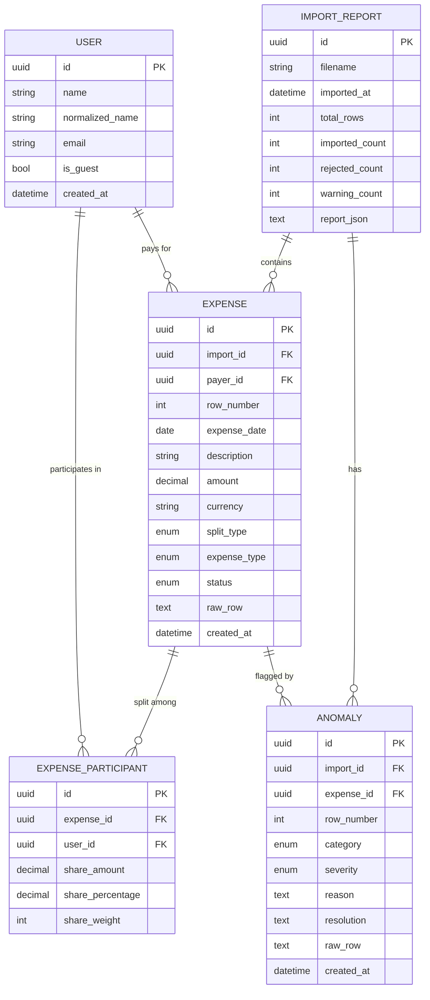

# Entity Relationship Diagram

## Entities and Relationships

---

## Design Decisions

### Why UUIDs as primary keys?
UUIDs prevent ID enumeration attacks and work well in distributed / multi-import contexts where sequential IDs could collide across different import batches.

### Why `normalized_name` on User?
Name normalization (case, whitespace, abbreviations) is a core anomaly-detection task. Storing the canonical lowercase-stripped form separately allows fast deduplication lookups without re-normalizing at query time.

### Why `payer_id` is nullable on Expense?
Row 12 in the CSV has a missing payer (`paid_by` empty). The system must import such rows with a `MISSING_PAYER` anomaly rather than rejecting them outright — they may have actionable split information.

### Why `raw_row` is stored on both Expense and Anomaly?
Full auditability. The original CSV row (as JSON) is preserved so any import decision can be traced back to exactly what was in the file. This is especially important for anomalies where the system makes inferences.

### Why a separate `expense_type` (EXPENSE / SETTLEMENT / REFUND)?
Settlements and refunds require different business logic (no participant share computation for settlements; negative share distribution for refunds). Mixing them with normal expenses without a type discriminator would pollute aggregations.

### Why `ImportReport.report_json`?
The structured import report is stored as a JSON blob alongside the normalized relational data. This allows the full human-readable report to be retrieved in a single query without re-aggregating at read time.

### Indexes

| Index | Columns | Reason |
|---|---|---|
| `ix_expenses_import_date` | `import_id, expense_date` | Filter expenses by import + date range |
| `ix_expenses_payer_date` | `payer_id, expense_date` | Filter by payer over time |
| `ix_anomalies_import_severity` | `import_id, severity` | Dashboard anomaly counts per severity |
| `ix_anomalies_import_category` | `import_id, category` | Filter anomalies by category |
| `uq_users_normalized_name` | `normalized_name` | Prevent duplicate users |
| `uq_participant_expense_user` | `expense_id, user_id` | Prevent duplicate participants per expense |
